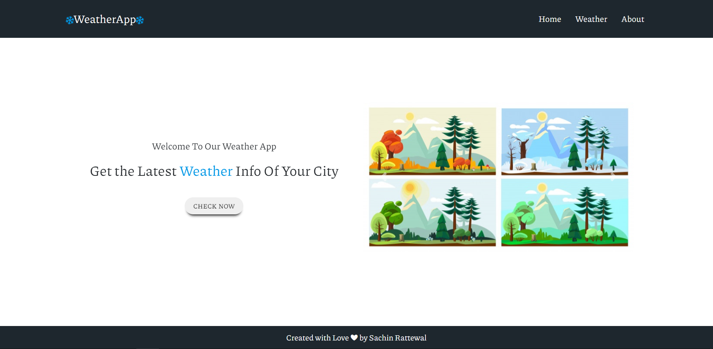
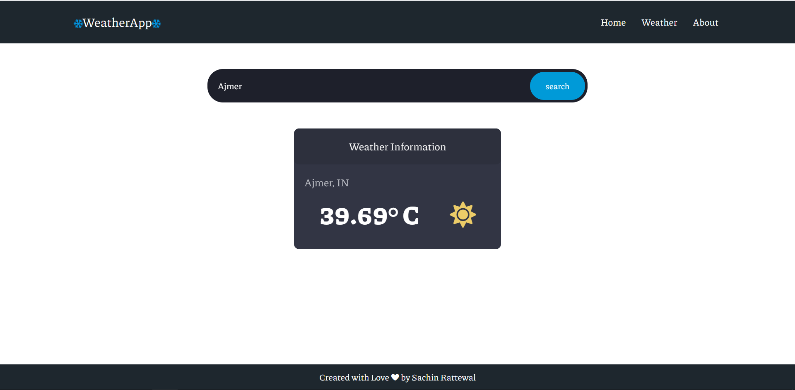

# WeatherApp
A web applicaion dedicated to displaying real time weather information of places across the globe.

# Functionalities

  ## Display weather forecast from a city name

   i. Search a city via the input in the form
   
   ii. Weather details of all cities within seconds from real time weather API.
   
   iii. Along with temperature, weather status(sunny or cloudy) is also dispalyed for each city.
   

# Screenshots

# Link for the Web Application

Demo : https://weatherapp-sachinrattewal.herokuapp.com/

